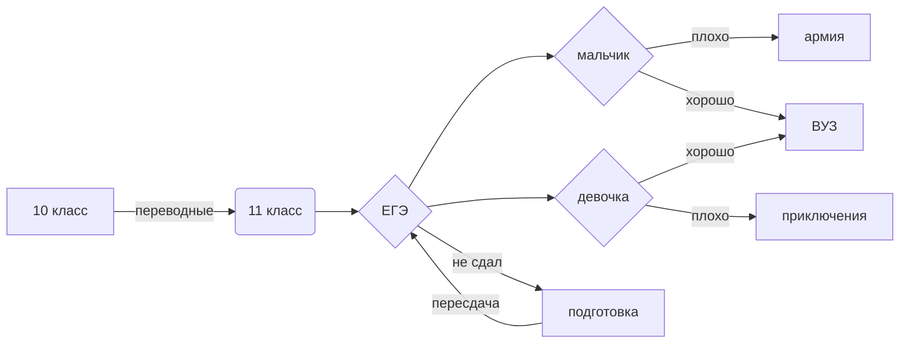

#jk
Жумангалиева Карина и Ермакова Анна 031, группа Валеры Ухова тестировщики
сколько таблиц в базе данных?
Вводим SQL-запрос: SELECT COUNT(*) FROM information_schema.tables WHERE table_schema = 'p518238_lyc'

вывести все из таблицы с пользователем
Вводим SQL-запрос: SELECT * FROM users

вывести все оценки
Вводим SQL-запрос: SELECT * FROM grades

вывести пользователей и их оценки
Вводим SQL-запрос: SELECT * FROM users JOIN grades on users.user_id=grades.user_id

найти количество зписей с именем Олег
Вводим SQL-запрос: SELECT * FROM users WHERE name='Олег'

https://ovsyug.wordpress.com/ сайт

https://miro.com/welcomeonboard/WUtWMUpVMGlCTGxhRkN4QVF4TUFaVzQ5dTBZemJzeDg3Y0ljT0dpMjM2Znhvc1NqYm1ONjV3M01FTTdISzBKdnwzNDU4NzY0NTM4NDk1ODE4MzEyfDI=?share_link_id=536845104220

https://view.genial.ly/637b026b775d400018527d47/interactive-image-interactive-image

$\frac{PV}{T}=\vartheta R$

$\frac{\upsilon^2}{R}=a$

$\upsilon=\sqrt{\frac{GM}{R}}$

https://www.nsu.ru/local/templates/nsu_ru_mca/images/opengraf.jpg

